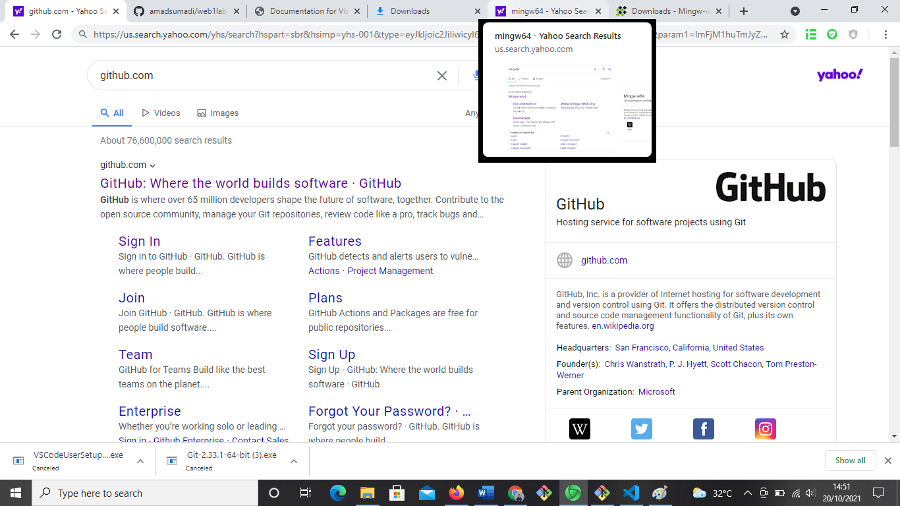
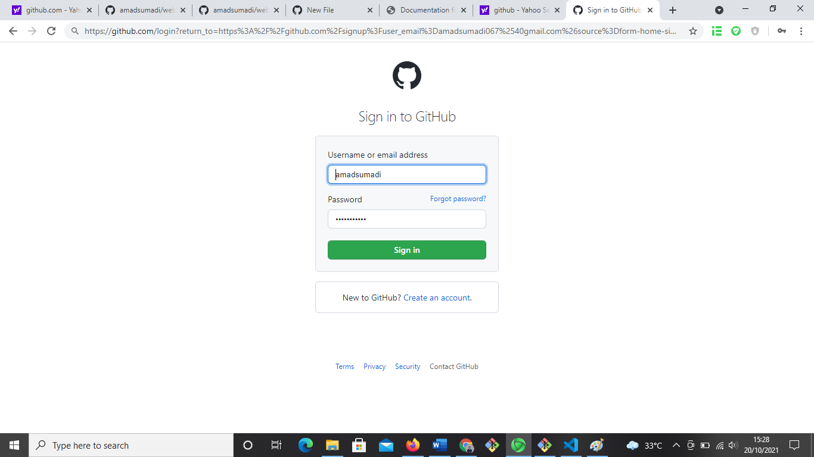
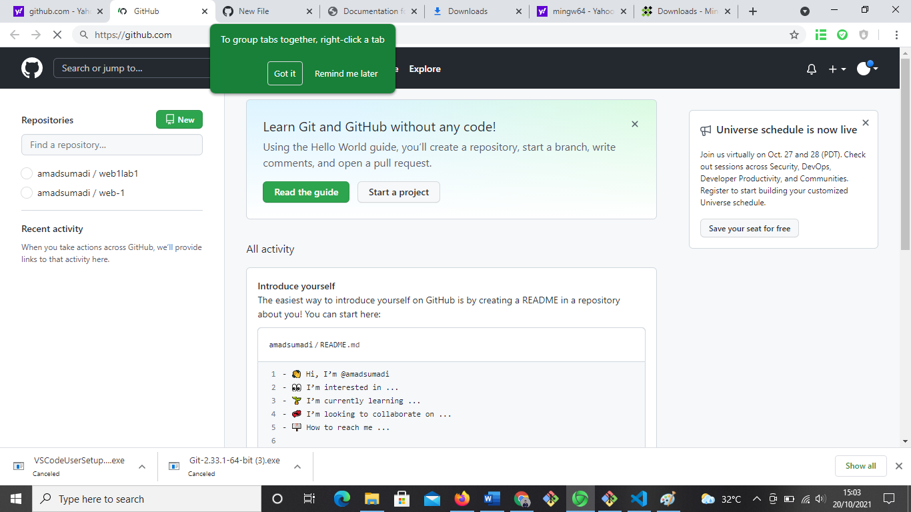
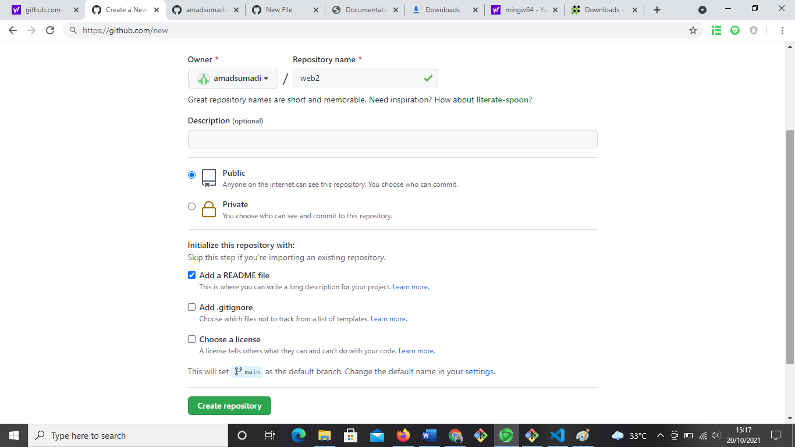

# tugasbp
## Belajar Membuat Repository melalui github

### Apa itu Github
Platform Github adalah layanan web host untuk kebutuhan pengembangan perangkat lunak di kalangan back end developer dengan sistem kendali Git Version. Pada praktiknya, platform ini mampu memberikan akses kontrol dan kolaborasi antar tiap developer untuk dapat memanajemen tugas, perbaikan bug, dan pembuatan dokumentasi pada proyek.'
'
Sedangkan Repository itu berfungsi seperti tempat menyimpan atau mengumpulkan file
sebelum membuat repository kita masuk dulu ke github kalau belum punya akun nanti kita buat dulu
1. pertama kita masuk ke github dulu untuk mebuat repository

2.	Kemudian, Ketika masuk nanti akan terlihat seperti ini jika sudah melihat gambar ini lalu tekan sign in 

3. Kemudian nanti akan muncul gambar di layer seperti ini lalu masukkan akun kalian lalu tekan “sign in” jika sudah mempunyai akun,  jika belum punya akun bisa tekan “create an account”

4. Lalu akan muncul tampilan layer seperti ini 
Untuk membuat repository tekan “new” 

5. Setelah di klik nanti akan muncul tampilan seperti ini ,setelah masuk kemudian isi ”repository name”, kemudian “description [optional]”  kemudian pada pilihan “initialize this repository” pilih “add a README file”  kemudian klik “create repository”

6. Lalu akan muncul tampilan seperti in

7. Kemudian kita download git-scm 

8. lalu stelah terdownload langsung diinstal 
  jika ada perintah next pencet next terus sampek finish 
  sebelum tekan tombol finish jangan lupa centang git bas
 9.setelah itu masuk ke github kemudian buat repository baru 
  setelah itu kita konekan dengan gitbas
  masukkan langkah langkah dan gambar agar lebih gamblang
  
  
  sekian 

